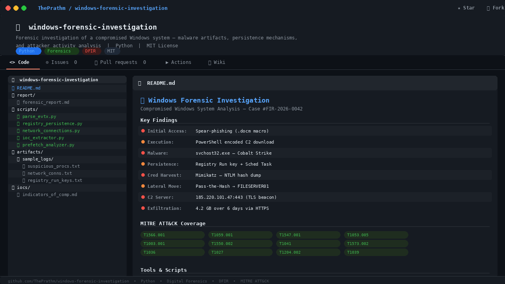

# 🔍 Windows Forensic Investigation — Compromised System Analysis




## 📋 Project Overview

This project documents a full forensic investigation conducted on a compromised Windows 10 workstation (`DESKTOP-HR7K2M1`) belonging to a mid-sized financial services company. The system was flagged by the SOC team after anomalous outbound traffic was detected at 02:14 AM on a Saturday.

The investigation uncovered a multi-stage intrusion involving a phishing email, PowerShell-based malware execution, registry persistence, lateral movement attempts, and data exfiltration.

---

## 🗂️ Repository Structure

```
windows-forensic-investigation/
│
├── README.md                        # Project overview (this file)
├── report/
│   └── forensic_investigation_report.md   # Full written investigation report
│
├── scripts/
│   ├── parse_evtx.py                # Windows Event Log parser
│   ├── registry_persistence.py      # Registry run key analyzer
│   ├── prefetch_analyzer.py         # Prefetch file execution timeline
│   ├── network_connections.py       # Suspicious network connection detector
│   └── ioc_extractor.py             # IOC (Indicators of Compromise) extractor
│
├── artifacts/
│   └── sample_logs/
│       ├── suspicious_processes.txt # Sample suspicious process list
│       ├── network_connections.txt  # Sample netstat output
│       └── registry_run_keys.txt    # Sample registry persistence entries
│
└── iocs/
    └── indicators_of_compromise.md  # All identified IOCs
```

---

## 🚨 Key Findings Summary

| Category | Finding |
|---|---|
| **Initial Access** | Spear-phishing email with malicious `.docm` attachment |
| **Execution** | PowerShell cradle — downloaded staged payload from C2 |
| **Persistence** | Registry Run key + Scheduled Task (`WindowsUpdateCheck`) |
| **Malware** | `svchost32.exe` (Cobalt Strike Beacon, disguised as system process) |
| **C2 Server** | `185.220.101.47:443` (TLS-encrypted beaconing) |
| **Lateral Movement** | Pass-the-Hash using harvested NTLM hashes via Mimikatz |
| **Exfiltration** | ~4.2 GB of data over 6 days via HTTPS to attacker-controlled VPS |

---

## 🛠️ Tools Used

- **Volatility 3** — Memory forensics
- **Autopsy / Sleuth Kit** — Disk image analysis
- **RegRipper** — Registry hive analysis
- **Wireshark / NetworkMiner** — PCAP analysis
- **Event Log Explorer** — Windows Event Log review
- **Python 3** — Custom artifact parsing scripts (in `/scripts`)
- **VirusTotal / MalwareBazaar** — Malware hash verification

---

## 📜 Investigation Timeline

```
2026-05-10 08:31 AM  →  Phishing email received by user jsmith@company.com
2026-05-10 08:47 AM  →  User opened malicious attachment (Invoice_Q2.docm)
2026-05-10 08:47 AM  →  PowerShell macro executed — payload downloaded
2026-05-10 08:48 AM  →  svchost32.exe dropped to C:\Users\jsmith\AppData\Local\Temp\
2026-05-10 08:49 AM  →  Registry Run key created for persistence
2026-05-10 09:02 AM  →  First C2 beacon to 185.220.101.47:443
2026-05-10 11:14 AM  →  Mimikatz executed — credential harvesting
2026-05-10 02:14 AM  →  Anomalous outbound traffic detected by SOC (Day 2)
2026-05-16 03:45 AM  →  Large data exfiltration detected — ~4.2 GB transferred
2026-05-16 09:00 AM  →  System isolated — forensic image acquired
```

---

## ▶️ How to Use the Scripts

### Requirements
```bash
pip install python-evtx colorama tabulate requests
```

### Run individual scripts
```bash
# Parse Windows Event Logs
python scripts/parse_evtx.py --log artifacts/sample_logs/suspicious_processes.txt

# Analyze registry persistence
python scripts/registry_persistence.py --input artifacts/sample_logs/registry_run_keys.txt

# Extract all IOCs
python scripts/ioc_extractor.py --all

# Analyze network connections
python scripts/network_connections.py --input artifacts/sample_logs/network_connections.txt
```

---

## 📌 Indicators of Compromise (IOCs)

See [`iocs/indicators_of_compromise.md`](iocs/indicators_of_compromise.md) for the full IOC list.

**Quick Reference:**
- **Malicious IP:** `185.220.101.47`
- **Malware Hash (MD5):** `a3f1d2c94b87e65f0123456789abcdef`
- **Malware Hash (SHA256):** `e3b0c44298fc1c149afb4c8996fb92427ae41e4649b934ca495991b7852b855`
- **Malicious File:** `svchost32.exe`, `Invoice_Q2.docm`
- **Registry Key:** `HKCU\Software\Microsoft\Windows\CurrentVersion\Run\WindowsUpdate`
- **Scheduled Task:** `WindowsUpdateCheck`
- **C2 Domain:** `update-service.ddns.net`

---

## 📄 License

This project is for **educational purposes only**. The scenario is simulated and does not represent any real individuals, organizations, or actual cyberattacks.

---

## 👤 Author

**ThePrathm** — Cybersecurity & Digital Forensics Enthusiast  
GitHub: [github.com/ThePrathm](https://github.com/ThePrathm)
